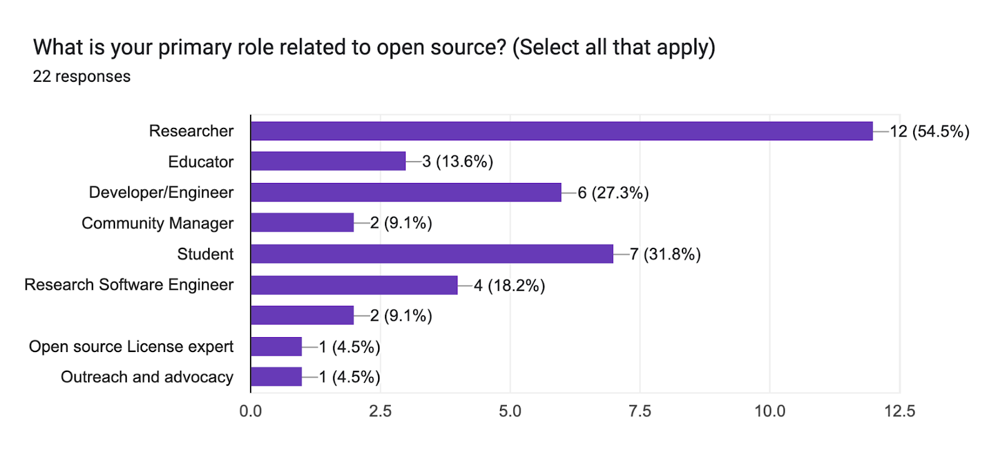
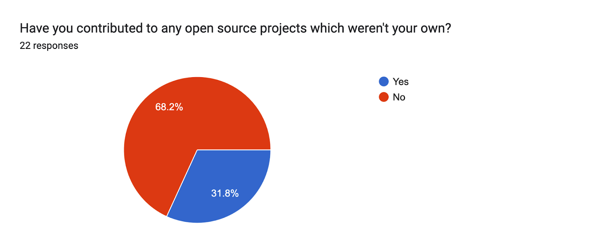
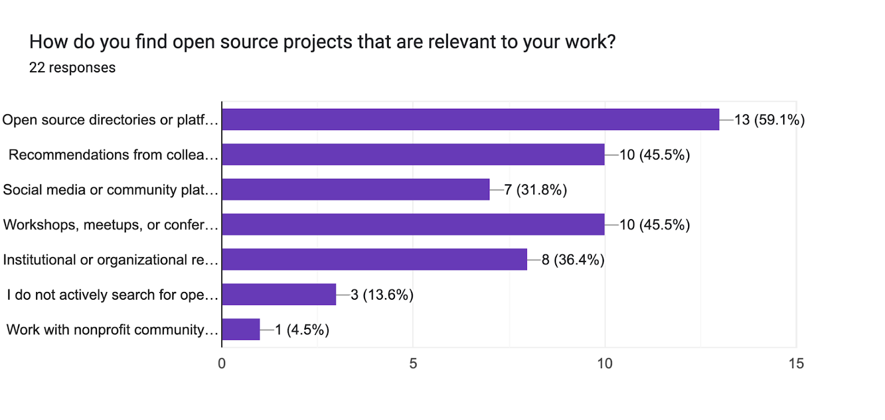
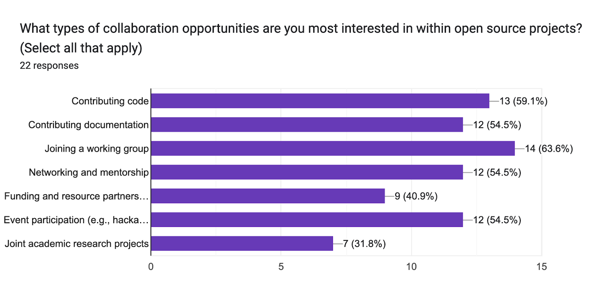
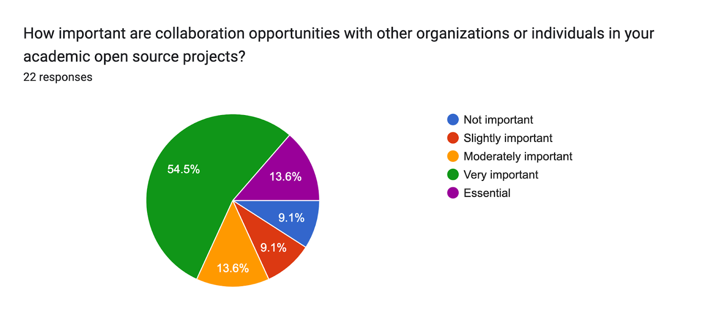

# Mapping the Academic Open Source Ecosystem: Insights from a Community Survey

Written by [Regina Nkenchor](https://www.linkedin.com/in/reginankenchor/).

## 1. Executive Summary

The open source software (OSS) landscape within academia is dynamic but under-documented. While academic OSS powers critical research, infrastructure, and pedagogy across disciplines, it often operates in silos—under-recognized, inconsistently supported, and difficult to navigate. The Academic Open Source Ecosystem Map, developed by the SustainOSS community, aims to address this by building a shared resource that identifies and contextualizes key academic OSS projects, contributors, and governance models.

To inform this initiative, the SustainOSS team launched a short survey in late 2024 titled “Mapping the Open Source Ecosystem in Academia.” The survey remained open from November 20, 2024 through March 20, 2025, allowing time for wide circulation and reflection.The survey received 22 responses from individuals active in or adjacent to academic OSS. Participants spanned a range of roles—including researchers, educators, software engineers, and community organizers—and offered detailed feedback on contribution patterns, project discovery, collaboration practices, impact assessment, and ecosystem challenges.

Key findings include:

* Most contributors engage across multiple domains, highlighting the interdisciplinary and hybrid nature of academic OSS work.
* Discovery of academic OSS projects is fragmented. While platforms like GitHub are central to hosting and collaboration, respondents reported difficulty identifying academic-relevant projects due to the lack of structured, curated, or disciplinary discovery tools.
* Contributors face persistent uncertainties around licensing, institutional policy, and where or how to share academic software.
* Respondents expressed strong interest in non-code collaboration (e.g., documentation, mentorship, working groups), challenging narrow definitions of OSS contribution.
* Impact is measured through a combination of citations, reuse, collaboration, and teaching, but there is no consensus on which indicators are most meaningful or valid.

These insights inform a set of practical directions for evolving the Academic Map, including a focus on role diversity, discoverability, alternative impact signals, and inclusive pathways for contribution.

## 2. Introduction

Open source software has become an indispensable component of academic research and teaching. It enables reproducibility, accelerates innovation, and facilitates collaboration across disciplines and institutions. Research from Harvard Business School has quantified the broader economic significance of open source, estimating its global demand-side value at $8.8 trillion. This number includes academic open source. Yet, despite its growing importance, the academic open source software ecosystem remains difficult to visualize, access, or navigate. Projects are often isolated from one another, developed independently within research labs, departments, or consortia, and rarely mapped in a way that supports cross-pollination or strategic coordination.

The Academic Open Source Ecosystem Map, developed through the SustainOSS community, seeks to address this gap. It aims to create a public, openly licensed resource that brings visibility to academic OSS projects, contributors, and governance structures. Unlike most directories focused on code repositories, this map is intended to foreground the human, organizational, and epistemic infrastructures that support OSS in academic contexts.

To inform this initiative, the SustainOSS team launched a short survey in late 2024 titled “Mapping the Open Source Ecosystem in Academia.” The goal of the survey was to better understand the current practices, needs, and constraints of those involved in academic OSS. Who contributes? How do they find and assess relevant projects? What roles do they play? What makes academic OSS discoverable, impactful, or sustainable?

This report presents a detailed account of the survey’s findings. Although the respondent pool was modest in size, the responses offer rich insight into how academic OSS is experienced and sustained in practice. Through this report, we hope to articulate both the opportunities and frictions shaping the academic OSS ecosystem—and to guide future iterations of the Academic Map in ways that reflect and support the community it aims to serve.

## 3. Methodology

### 3.1 Survey Design and Objectives

The survey titled *“Mapping the Open Source Ecosystem in Academia”* was designed to collect baseline information from individuals involved in academic open source software (OSS). The objective was to better understand the current practices, challenges, and expectations of contributors in academic contexts in order to inform the design and development of the SustainOSS Academic Map.

The survey included a combination of multiple-choice, multi-select, Likert-scale, and open-ended questions. Topics covered included:

* Primary roles in OSS
* Project discovery methods
* Contribution patterns
* Collaboration preferences
* Impact assessment
* Institutional support
* Challenges and barriers
* Project visibility and recognition

Respondents were also given the opportunity to name specific projects, organizations, or initiatives they believed should be featured on the Academic Map.

All responses, unless explicitly marked sensitive, were gathered under the understanding that they would be shared openly under a permissive license via the project’s public GitHub repository.

### 3.2 Data Collection Period and Distribution

The survey was open for responses from **November 20, 2024 to March 20, 2025**, allowing for four months of participation. It was distributed through a combination of channels, including:

* Academic and research software mailing lists
* SustainOSS community newsletters and events
* LinkedIn, Twitter/X and Mastodon posts from SustainOSS contributors
* Targeted outreach to known academic OSS contributors and networks

The survey was implemented using Google Forms, and responses were collected anonymously unless respondents opted to provide contact details.

### 3.3 Respondent Profile

A total of **22 individuals** completed the survey. While not intended to be a statistically representative sample of the entire academic OSS ecosystem, the responses reflect a wide range of professional roles and affiliations. Participants included individuals identifying as:

* Researchers
* Educators
* Research Software Engineers
* Community Managers
* Policy Advisors
* Outreach and Advocacy Specialists
* Developers
* Legal and licensing experts

Several respondents reported holding multiple roles, underscoring the hybrid nature of academic OSS labor.

### 3.4 Analytical Approach

The data analysis followed a mixed-methods approach:

* Quantitative questions (e.g., multi-select checkboxes, yes/no, Likert-scale) were analyzed using basic descriptive statistics and visualized through bar charts.
* Open-ended responses were reviewed manually and coded for emergent themes. Keyword frequency analysis was used to surface common concerns in free-text fields, and selected quotations were retained for qualitative interpretation.

No advanced statistical modeling was applied, given the modest sample size. However, results were treated as indicative of broader patterns that warrant further exploration through future surveys, interviews, or workshops.

## 4. Who Is Building Academic Open Source Software?

Survey respondents were asked to identify their primary roles in relation to open source, with the option to select multiple. The results suggest that academic OSS is sustained by individuals occupying diverse and often overlapping roles. The most frequently cited roles were:

* Researcher
* Educator
* Research Software Engineer
* Community Manager
* Outreach and Advocacy
* Developer
* Legal and Policy Advisor

Many respondents selected more than one role, indicating the hybrid and interdisciplinary nature of OSS work within academic settings.

<!-- markdownlint-disable-next-line MD033 -->
<em>Figure 1: Primary Roles in Academic Open Source Software (n=22)</em>

This role distribution reinforces the notion that academic OSS does not reside solely within the domain of technical software development. Instead, it is shaped by educators who integrate tools into curricula, researchers who develop and rely on OSS in their work, and community managers who support adoption and collaboration.

One respondent reflected on this interplay of responsibilities:

> *“In academic OSS, you often end up doing everything—writing the code, managing the team, applying for funding, and teaching with the tools you built.”*

Another noted:

> *“My role doesn’t fall into a single category. I’m a researcher, but I also mentor contributors, write docs, and maintain governance policies.”*

These findings underscore that academic OSS labor often spans roles typically separated by institutional structures or disciplinary silos. The Academic Map, in capturing this ecosystem, must account for the multiplicity of contributions that sustain these projects—not just lines of code or citations.

### 4.1 Preferred Information Formats for the Map

In addition to exploring roles and project engagement, the survey asked respondents to identify which formats of information they would find most useful in an academic open source ecosystem map. The responses reflected a strong preference for multi-format, interactive, and narrative-driven content.

The most frequently requested formats were:

* Written descriptions and documentation
* Visuals such as infographics or organizational charts
* Interactive tools (e.g., searchable project maps, role filters)
* Data dashboards tracking project activity or contributions
* Case studies or impact stories
* Academic case studies or research papers

<!-- markdownlint-disable-next-line MD033 -->
<em>Figure 2: Preferred Formats of Information in an Academic OSS Ecosystem Map</em>

A few respondents selected only one format, while many chose combinations. One respondent specifically requested Git history visualization tools, indicating an interest in technical transparency and longitudinal insight.

This diversity of preferences suggests that a successful ecosystem map must cater to a wide range of users—from those seeking narrative or institutional context to those pursuing deeper technical metrics or collaboration pathways. The emphasis on interactivity and layered information further supports the need for a flexible, user-driven interface that can serve different discovery styles and information needs.

## 5. Contribution Patterns

To understand the degree of collaborative engagement within the academic open source (OSS) community, the survey asked respondents whether they had contributed to open source projects they did not originate or maintain themselves. The goal was to distinguish between contributors who work primarily on self-initiated or institution-specific tools, and those who actively engage with broader, community-led OSS ecosystems.

The majority of respondents (15 out of 22) indicated that they had not contributed to external OSS projects, while 7 respondents reported that they had. This distribution may reflect multiple factors, including limited exposure to relevant projects, lack of institutional support for external engagement, and time or skill constraints.

<!-- markdownlint-disable-next-line MD033 -->
<em>Figure 3: Contribution to External OSS Projects</em>

Several open-ended responses provided insight into these barriers:

> * *“I don’t know where to look.”*
> * *“Time.”*
> * *“Not understanding some of the terminologies like git.”*

These comments point to a landscape in which many potential contributors face structural or informational challenges that inhibit broader participation. The distinction between those developing OSS for their own academic needs and those contributing to shared, public infrastructure appears to be a key axis within the academic OSS community. Recognizing and addressing this difference may be essential for understanding participation patterns and supporting more inclusive engagement

## 6. Discoverability and Challenges

Academic open source software (OSS) plays a critical role in research and teaching, but for many contributors, finding the right projects—whether to adopt or to contribute to—remains a persistent challenge.

Respondents were asked how they typically discover OSS projects relevant to their academic work. The most frequently selected methods were:

* Open source directories or platforms (e.g., GitHub, GitLab)
* Recommendations from colleagues or collaborators
* Conferences or workshops
* Social media or newsletters
* Academic publications (selected least often)

<!-- markdownlint-disable-next-line MD033 -->
<em>Figure 4: Project Discovery Channels</em>

These results suggest that discoverability in academic OSS is largely informal, driven by personal networks and general-purpose technical platforms. Traditional academic channels, including peer-reviewed publications or institutional repositories, appear to play a minimal role.

This reliance on social or ad hoc channels introduces a degree of randomness—and, for some, exclusion—into the discovery process. The lack of centralized or discipline-specific directories may especially hinder newcomers or those outside well-networked institutions.

In open-ended responses, several participants expressed this challenge directly:

> * *“I don’t know where to look.”*
> * *“I do not actively search for open source projects.”*
> * *“No clear description, no platform for academic open source projects.”*
> * *“Key words in Google.”*

These remarks reflect a consistent theme: the absence of dedicated infrastructure or interfaces for navigating academic OSS. Instead, discovery often depends on prior knowledge, informal mentoring, or algorithmic chance.

If included, the keyword analysis below further visualizes the language most commonly used by respondents when describing barriers to discovery.

## 7. Collaboration Models

While open source software development is often framed as a technical activity, the survey results reveal that academic OSS contributors are interested in a broad range of collaborative roles, many of which extend beyond code. Respondents were asked to select the types of collaboration opportunities they find most valuable when engaging with open source projects.

The most commonly selected forms of collaboration were:

* Joining a working group
* Contributing documentation
* Networking and mentorship
* Event participation (e.g., hackathons, conferences)
* Contributing code

<!-- markdownlint-disable-next-line MD033 -->
<em>Figure 5: Preferred Forms of Collaboration in OSS Projects</em>

The prominence of non-code options—such as documentation, events, and working groups—suggests that academic contributors view OSS as a space for shared inquiry, coordination, and knowledge exchange. This contrasts with traditional narratives that prioritize code commits as the primary measure of involvement.

Several respondents emphasized this diversity in their open-ended feedback. While the survey did not ask a dedicated question about motivations, their selections and additional comments indicate a preference for collaborative structures that support learning, peer support, and long-term community formation.

This finding aligns with recent research on sustainability in open source communities, which highlights the importance of inclusive, role-diverse participation models. In academic contexts, where contributors often work under time constraints and within teaching or research mandates, offering a range of participation pathways may be especially critical.

In a follow-up question, respondents were also asked how important collaboration is in their academic OSS work overall. Responses strongly reinforced the earlier pattern:

* 12 respondents described collaboration as “Very important”
* 3 selected “Essential”
* Only 4 rated it Moderately, Slightly, or Not important

<!-- markdownlint-disable-next-line MD033 -->
<em>Figure 6: Importance of Collaboration in Academic OSS</em>

These results affirm that collaboration is not simply valued — it is often integral to how academic contributors understand participation in open source. Whether through shared infrastructure, co-development, or community support, collaboration appears to be a defining feature of academic OSS culture.

## 8. Understanding Impact

Assessing the impact of open source software in academic contexts presents unique challenges. Unlike traditional scholarly outputs, OSS often lacks standardized metrics of success or visibility within institutional evaluation frameworks. To understand how contributors themselves assess impact, the survey asked participants to select indicators they consider meaningful when evaluating an academic OSS project.

The most frequently selected metrics were:

* Citations in academic publications
* Contributions from outside the original team
* Collaborations formed through the project
* Mentions in non-academic media or platforms
* Use in teaching or curricula

<!-- markdownlint-disable-next-line MD033 -->
<em>Figure 7: Indicators of OSS Project Impact</em>

While citations remain the most commonly selected metric—reflecting their institutional weight within academia—respondents also placed substantial value on networked and community-based indicators. The presence of contributors beyond the original development team, for example, was seen as a sign of reach, relevance, and sustainability.

Several respondents also highlighted the educational value of OSS:

> * *“Impact to me means the tool is cited, reused, and ideally picked up in a classroom or another lab.”*
> * *“Teaching use is often overlooked, but it's where our software has the most real-world impact.”*

Notably, few respondents relied solely on academic metrics. Instead, most adopted a hybrid model, recognizing both scholarly outputs and broader forms of influence. This aligns with ongoing discussions in the open science and research software communities, where impact is increasingly understood as multidimensional—encompassing citations, community growth, educational adoption, and collaborative expansion.

The variety of responses also points to an underlying challenge: the lack of consensus around what impact means in academic OSS. This ambiguity may affect how projects are valued, maintained, and supported across institutions and disciplines.

## 9. Discussion

The responses gathered through this survey offer a valuable, if modest, lens into the academic open source software (OSS) ecosystem. Rather than recapitulate the findings, this section reflects on the underlying dynamics, tensions, and systemic gaps they reveal. These observations point not only to the state of academic OSS participation but also to the institutional and infrastructural contexts in which it is embedded.

### 9.1 The Blurred Boundaries of Academic OSS Labor

Respondents frequently described occupying multiple roles—researcher, educator, developer, community facilitator—often simultaneously. This hybridity suggests that academic OSS work resists tidy categorization. Unlike conventional academic outputs, OSS requires a blend of technical, pedagogical, and organizational labor. However, this multiplicity is rarely acknowledged or rewarded within academic evaluation frameworks, which continue to privilege single-author publications and narrow conceptions of “impact.”

This is not a new observation. As Vasileios Karagiannis and colleagues (2020) argue in their research on research software engineers (RSEs), institutional job structures often fail to reflect the complexity of roles involved in sustaining digital academic infrastructure. The result is a persistent “professional invisibility,” where essential contributors to research outputs are excluded from career progression pathways, authorship credits, or institutional investment.

Similarly, Micah Altman and Mercè Crosas (2012), through their work on the Dataverse Project, have highlighted the critical importance of infrastructure stewardship in scholarly communication. Yet this type of work continues to be undervalued in metrics-driven academic cultures. Together, these studies affirm that the challenges uncovered in this survey reflect systemic patterns rather than isolated frustrations.

### 9.2 Challenges in Discoverability and Access

A recurring theme is the difficulty in discovering relevant OSS projects. Many respondents rely on informal networks or general platforms like GitHub, indicating a lack of centralized, academic-specific repositories. This fragmentation can hinder collaboration and the reuse of existing tools, particularly for newcomers or those outside well-connected institutions.

The need for better infrastructure is echoed in the Census III report by the Linux Foundation and Harvard's Laboratory for Innovation Science, which highlights the widespread use of OSS and the necessity for improved security and maintenance practices (Nagle et al., 2024).

### 9.3 The Centrality of Collaboration

Collaboration emerges as a cornerstone of academic OSS engagement. Respondents value diverse forms of collaboration, including working groups, mentorship, and event participation. This preference underscores the social dimension of OSS, where knowledge exchange and collective problem-solving are paramount.

However, institutional structures often fail to accommodate or reward these collaborative efforts. This disconnect can impede the sustainability and growth of OSS initiatives within academia.

### 9.4 Rethinking Impact Metrics

Traditional metrics like citation counts are insufficient to capture the full impact of OSS projects. Respondents also consider factors such as software reuse, integration into curricula, and community engagement as indicators of success.

This broader perspective on impact is supported by research from Harvard Business School, which estimates the demand-side value of OSS at $8.8 trillion, highlighting its extensive economic significance (Nagle, 2024). Such findings advocate for a more inclusive approach to evaluating OSS contributions in academia.

### 9.5 Barriers to Participation

Despite the recognized importance of OSS, barriers to participation persist. Challenges include limited time, lack of institutional support, and unfamiliarity with tools and processes. These obstacles can deter potential contributors and limit the diversity of the OSS community.

Addressing these barriers requires concerted efforts to provide training, resources, and institutional recognition for OSS activities.

## 10. Implications for the Academic Map

The insights gathered through this survey underscore the need for an academic open source ecosystem map that does more than catalog repositories. The findings point toward a broader rethinking of how infrastructure can support discovery, recognition, and connection within a fragmented and often under-resourced academic OSS landscape.

First, the map must account for the diverse roles that contributors play. Many participants identified as occupying multiple positions—researcher, developer, educator, and organizer—often at once. This hybridity reflects the nature of academic OSS itself, where boundaries between technical, pedagogical, and administrative work are blurred. A useful map should enable users to explore projects not just by topic or language, but by the types of roles involved. Making visible the full range of contributions—including documentation, mentorship, governance, and community support—would help shift attention away from narrow metrics of code commits or citations.

In addition, the survey revealed persistent frustration with discoverability. Contributors often rely on GitHub searches, peer recommendations, or chance encounters at conferences. Very few cited formal academic repositories or scholarly databases. The Academic Map should therefore function as an intermediary layer, connecting informal discovery channels with structured academic contexts. Rich metadata—covering disciplinary scope, licensing, institutional affiliation, and project maturity—will be essential. Moreover, respondents indicated a strong preference for varied information formats, from written descriptions to interactive dashboards and case studies. The map should reflect this by offering layered, navigable views that cater to both technical users and those seeking narrative or institutional context.

Collaboration emerged as both a value and a need. Most respondents described it as central to their work, and expressed interest in contributing in multiple ways, including through working groups, non-code tasks, and mentorship. Yet collaboration opportunities are often invisible. The map can address this by allowing projects to declare what kinds of participation they are seeking and providing mechanisms for individuals to filter or match based on those preferences. Equally important is surfacing information about governance—who maintains a project, how decisions are made, and how new contributors can join.

The discussion around impact also invites careful attention. Respondents adopted a hybrid model of assessing success, valuing both traditional metrics like citations and more community-oriented indicators like reuse, teaching integration, and external collaboration. Rather than imposing a single evaluative framework, the map should support plural metrics, allowing users to see multiple forms of influence side by side. Projects should be able to self-describe their intended goals and reflect their own communities’ values around success.

Finally, the survey pointed to barriers that are infrastructural as much as they are cultural—uncertainty around licensing, unclear institutional policies, and the lack of time or recognition. While the map cannot solve these challenges alone, it can make them visible. Showing which projects are institutionally supported, funded, or sustained can help identify gaps in the ecosystem and opportunities for targeted investment or advocacy.

Taken together, these findings suggest that the Academic Map must do more than display OSS projects. It should function as a connective layer—linking contributors, surfacing roles, signaling collaboration needs, and contextualizing impact. If successful, it can help transform how academic OSS is discovered, valued, and sustained.

## 11. Limitations

While this survey offers valuable insight into the academic open source software (OSS) ecosystem, it is important to acknowledge its limitations. First and foremost is the sample size. With 22 respondents, the data cannot be considered representative of the full range of perspectives, disciplines, or institutions involved in academic OSS. Rather than claiming generalizability, the findings should be understood as indicative—surfacing themes and tensions that merit further exploration.

Second, the survey distribution relied on channels already connected to the SustainOSS network, such as mailing lists, social media posts, and internal community outreach. This likely skewed the sample toward individuals who are already somewhat engaged in open source conversations and communities. Voices from institutions with less exposure to open source practices, or from contributors in under-resourced settings, may be underrepresented.

Third, while the survey included both structured and open-ended questions, it necessarily captured only surface-level reflections on complex topics such as governance, sustainability, and collaboration. Deeper qualitative insights—particularly those related to institutional barriers, contributor motivations, and impact practices—would benefit from follow-up through interviews, case studies, or co-design workshops.

Finally, the survey was conducted in English and distributed online, which may have limited participation from non-English-speaking communities or those with restricted digital access. Future efforts should aim for greater linguistic, geographic, and disciplinary diversity to better reflect the global nature of academic open source work.

Despite these constraints, the responses collected provide a meaningful foundation for further research, tool design, and community dialogue. They point to a set of recurring needs and structural gaps that can inform not only the Academic Map, but broader strategies for sustaining open source within scholarly environments.

## 12. Conclusion and Next Steps

This report has explored the practices, needs, and challenges shaping the academic open source software (OSS) ecosystem, as articulated by contributors across a range of roles and institutions. While the number of survey responses was modest, the perspectives offered are rich with insight. Together, they reveal an ecosystem that is active but fragmented, creative but structurally under-supported.

Contributors to academic OSS wear many hats: they teach, code, mentor, advocate, and organize. Yet this labor often goes unrecognized in conventional academic reward structures. At the same time, finding relevant OSS projects remains difficult due to a lack of centralized discovery tools and shared standards. Respondents expressed strong interest in collaboration—especially in non-code forms such as documentation, events, and working groups—and showed a clear preference for hybrid impact models that value both citations and broader community engagement.

The findings presented here are not a final statement, but a foundation. They point to patterns worth investigating further, and to opportunities for community dialogue, resource-building, and shared strategy. As the SustainOSS community continues to shape this initiative, the voices and experiences captured in this survey can serve as a compass—helping to align tools with lived realities, and infrastructure with imagination.

## Acknowledgments

This work was made possible through the ongoing support and collaboration of the SustainOSS community. Special thanks are due to all the individuals who took the time to complete the survey and share their experiences with academic open source software. Your insights and reflections form the foundation of this report and will help shape the future direction of the Academic Open Source Ecosystem Map.

We also acknowledge the broader network of open source practitioners, educators, researchers, and community organizers whose work continues to inspire and sustain efforts at the intersection of scholarship and open infrastructure. The challenges you navigate and the contributions you make are central to this evolving ecosystem.

Gratitude is extended to the organizers, facilitators, and contributors to the Open Source Academic Map initiative, as well as to the wider SustainOSS network, for providing the space and resources for this project to take root.

## References

* Altman, M., & Crosas, M. (2012). *Data Citation in the Dataverse Network*. In: For Attribution: Developing Data Attribution and Citation Practices and Standards. National Academies Press, pp. 99–106.
* Karagiannis, V., Haines, R., & Katz, D. S. (2020). *Recognizing the unrecognized: The role of research software engineers in academic research*. *Computing in Science & Engineering*, 22(2), 6–18. [https://doi.org/10.1109/MCSE.2020.2968513](https://doi.org/10.1109/MCSE.2020.2968513)
* Nagle, F., Powell, K., Zitomer, R., & Wheeler, D. A. (2024). *Census III of Free and Open Source Software – Application Libraries*. The Linux Foundation & Laboratory for Innovation Science at Harvard.
* Nagle, F. (2024). *The Economic Impact of Open Source Software*. Harvard Business School Working Paper No. 24-036.
